# Incremental-Airline-Data-Ingestion-Pipeline

## Project Overview

This project demonstrates an end-to-end data pipeline for ingesting and processing airline flight data using AWS services.
It leverages S3 for data storage, Glue for ETL, Redshift as the data warehouse, Step Functions for orchestration, and EventBridge for event-driven triggering.
The pipeline is designed for incremental updates, ensuring that only new data is processed for efficiency.

## Tech Stack:
*   Amazon S3 (for data storage)
*   AWS Glue (for Extract, Transform, Load - ETL)
    *   AWS Glue Crawler (for schema discovery)
    *   AWS Glue Data Catalog (for metadata management)
    *   AWS Glue Job (for data transformation and loading)
*   Amazon Redshift (as the data warehouse)
*   AWS Step Functions (for workflow orchestration)
*   Amazon EventBridge (for event-driven triggering)
*   Amazon SNS (for notifications)

## Architecture

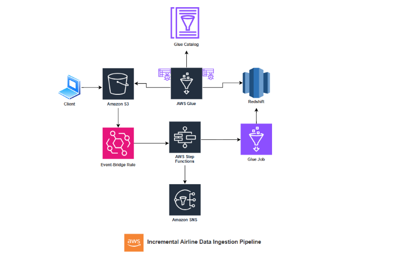

**Data Flow**

`Data Ingestion (S3):`
Raw flight data is stored in the **airlines-data-raw** S3 bucket, within the **flights-daily-raw** folder, and partitioned by date. Airport codes are stored in the **airport-codes** folder.

`Schema Discovery (Glue Crawlers):`
- Glue crawlers automatically discover and register schemas for:
- flights-daily-raw (from S3)
- daily-flights-processed (Redshift target table)
- airport-codes (Redshift table)

`Data Catalog (Glue Catalog):`
The Glue Data Catalog stores schema metadata for S3 and Redshift tables, enabling structured querying.

`Event Trigger (EventBridge):`
An EventBridge rule detects new partitions (folders) in flights-daily-raw/ and triggers the Step Functions state machine.

`Orchestration (Step Functions):`
The Step Functions state machine orchestrates the entire pipeline upon being triggered by EventBridge.

`ETL Process (Glue Job):`
The Glue job performs necessary transformations and loads the processed data into daily-flights-processed (Redshift).

`Data Loading (Redshift):`
Processed data is stored in the daily_flights_processed table in Redshift.

`Notifications (SNS):`
The Step Functions state machine sends a success or failure notification via SNS once the Glue job completes.

## Business Use Case

For airlines, timely access to accurate flight data is critical for operational efficiency, cost control, and informed decision-making. Incremental data processing addresses these needs by providing insights into flight operations and enabling data-driven decisions related to various operational metrics.

## Execution Steps

`1. S3 Bucket Structure`
This image shows the organization of raw data in S3, with separate folders for:
Airport Codes (reference data)
Flights-Daily-Raw (partitioned flight data)
The flights-daily-raw folder is partitioned by date (date=YYYY-MM-DD) for incremental processing.

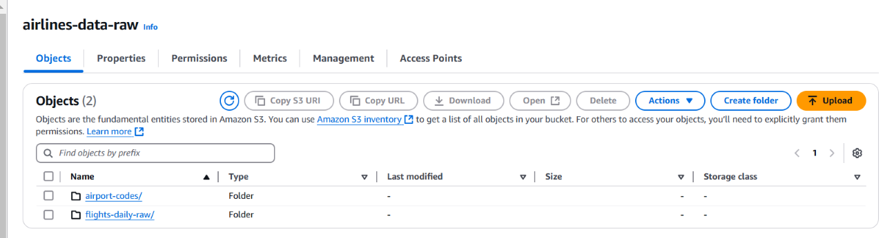

`2. EventBridge Rule`
Configured to detect new partitions (folders) in flights-daily-raw/, automatically triggering the Step Function.

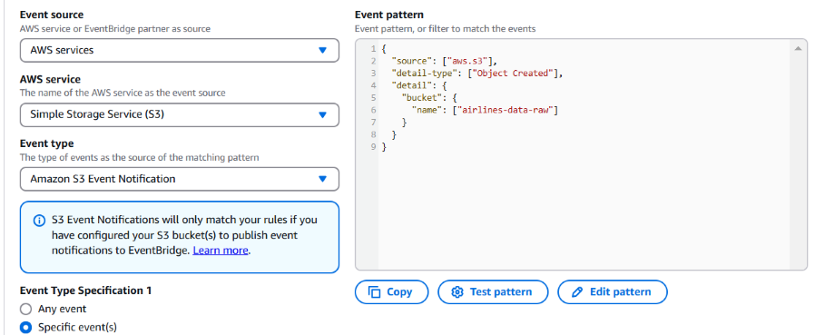

`3. Redshift Table Creation`
Creation of the airport-codes table in Redshift. Data successfully loaded from S3 using the COPY command
Schema creation for daily_flights_processed table.

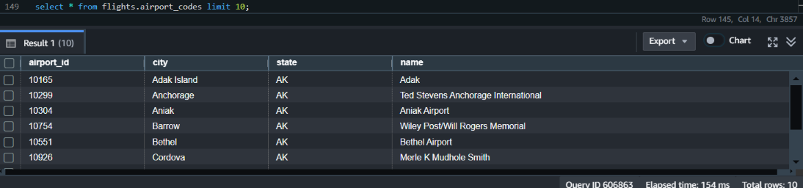

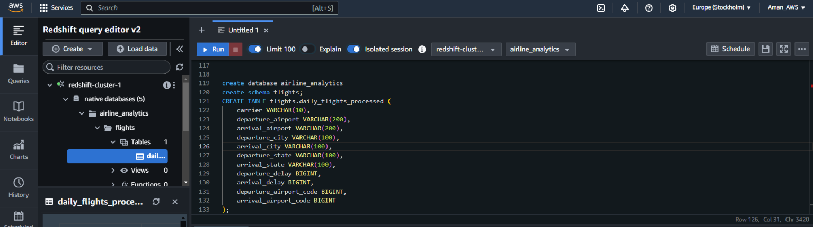

`4. Glue Catalog`
Displays the Glue Data Catalog after the Glue crawlers have run, successfully registering all tables.

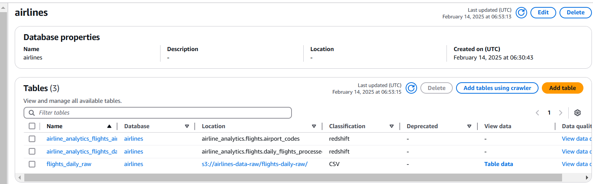

`5. Step Function Flow Diagram`
Visual representation of the ETL pipeline orchestration using AWS Step Functions.
Key steps:
- Start S3 crawler
- Check crawler status
- Start Glue job
- Wait for job completion
- Send SNS notifications (Success/Failure)

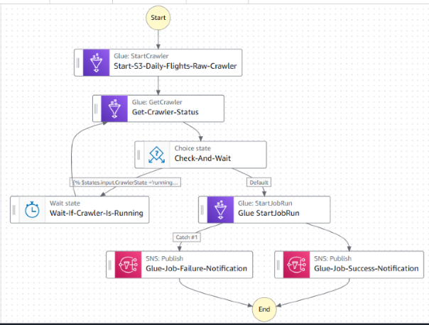

`6️. Visual ETL Job Flowchart`
Illustrates the transformations performed by the Glue ETL job.

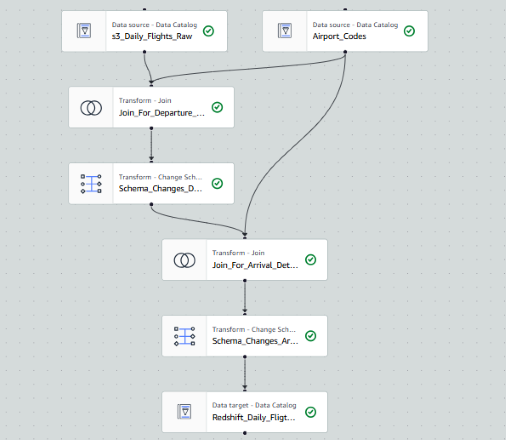

`7. Step Function successfully executed` 
As soon as the new file is added, step function is triggered, the image shows it is successfully executed.

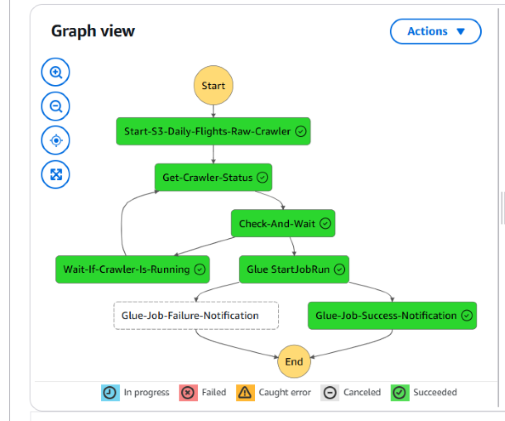

`8. ETL Job Success`
Indicates successful completion of the Glue ETL job as shown in the AWS Glue console.

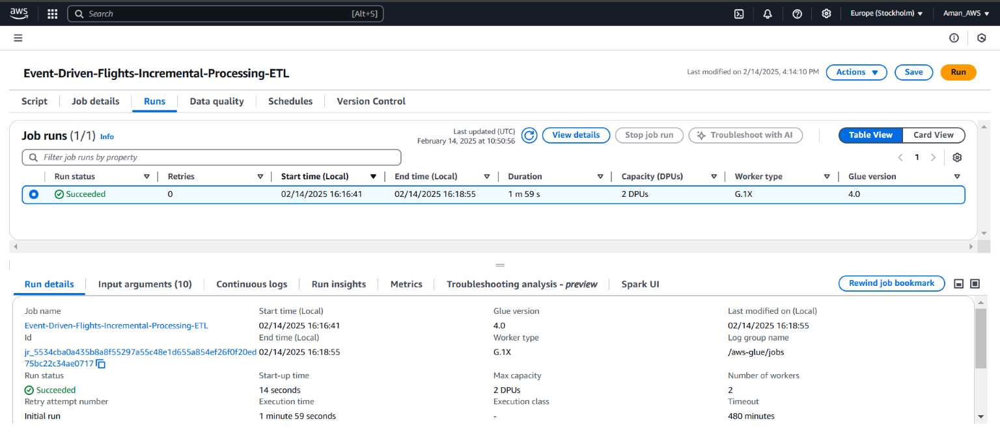

`9. Data in Redshift Table`
Shows the daily_flights_processed table populated with processed flight data after the ETL job execution.

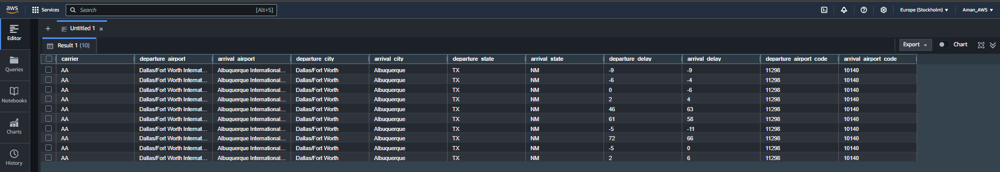

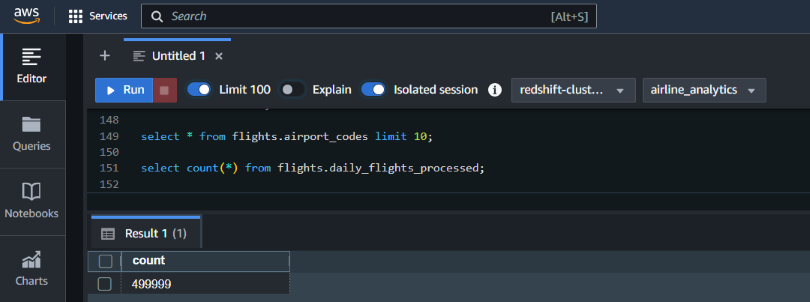

`10. SNS Job Success Notification`
Notification via SNS indicating successful execution of the ETL job.

## Future Enhancements:

1. Granular Event Triggering: Enhance the EventBridge rule to trigger the pipeline based on specific files in the daily-flights-raw S3 folder using prefix (e.g., /flights-daily-raw) and suffix (e.g., .csv) filtering.
2. Enhanced Monitoring: Integrate AWS CloudWatch Logs and Metrics for deeper visibility into Glue job and Step Functions executions.
3. Data Quality: Implement AWS Glue Data Quality and Redshift constraints to ensure data integrity.

## Conclusion

This project showcases an efficient, event-driven Airline Data Ingestion Pipeline using AWS services. 
By leveraging S3 for storage, Glue for ETL, Redshift as the data warehouse, Step Functions for orchestration, and EventBridge for automation, the pipeline ensures seamless incremental data processing.

Key learnings include schema discovery with Glue Crawlers, workflow automation with Step Functions, event-driven triggers using EventBridge, and optimized ETL transformations in Glue using Job-Bookmarking. 
The implementation of partitioned data ingestion and automated notifications via SNS enhances both efficiency and reliability.

## 👨‍💻 Author
Hi, I’m Aman Saxena!, an aspiring Data Engineer. Feel free to connect on amansaxena129@gmail.com
